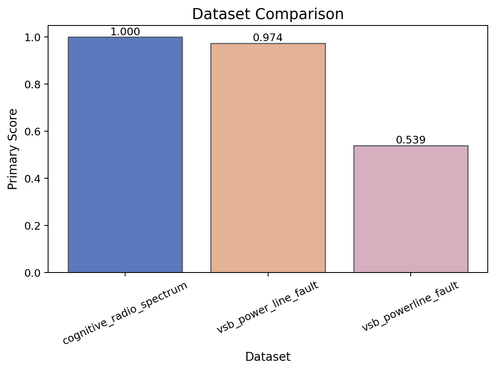
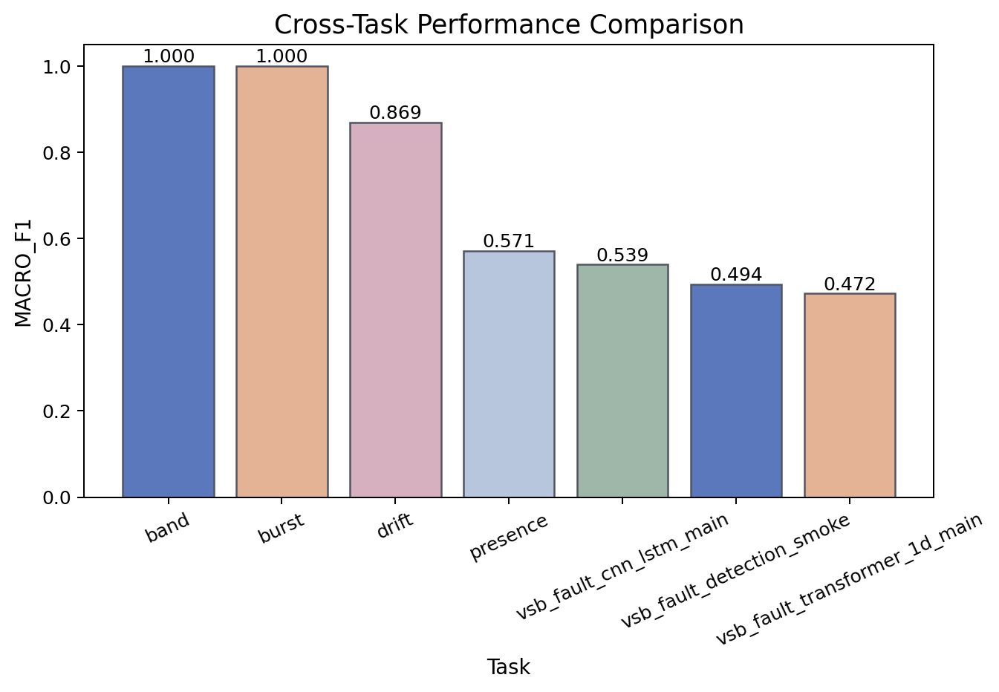
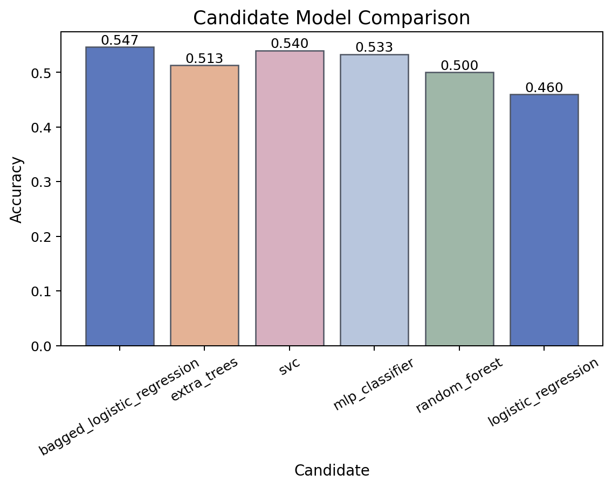
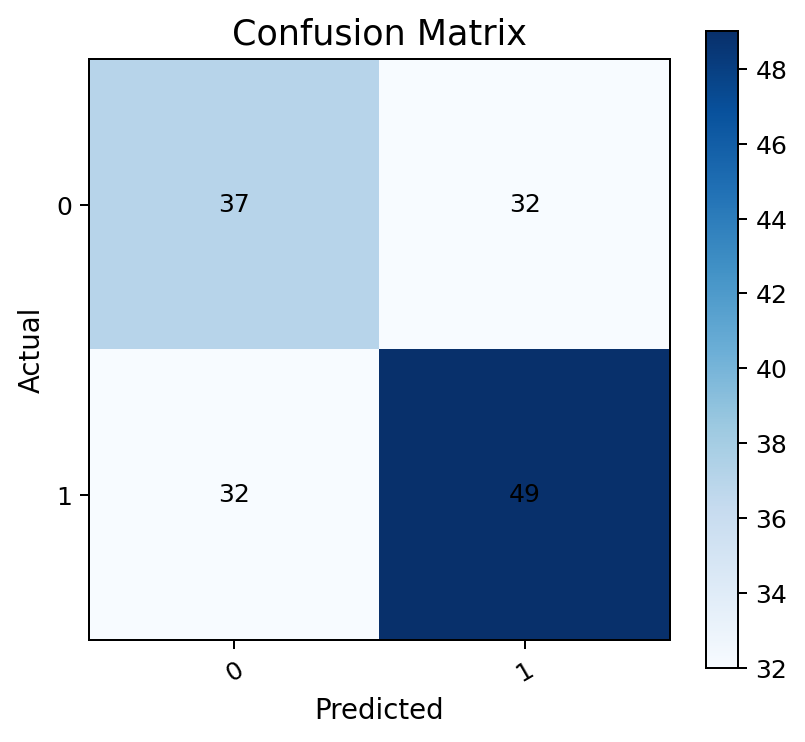
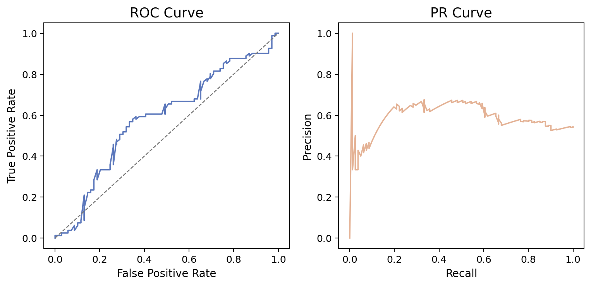
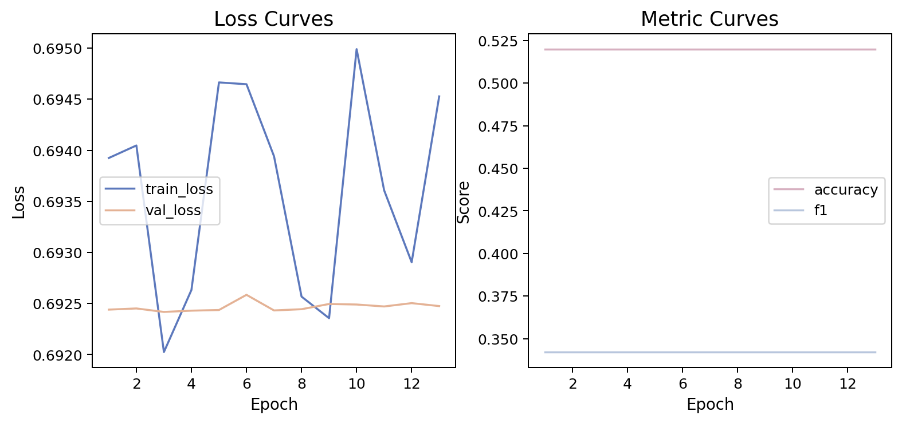
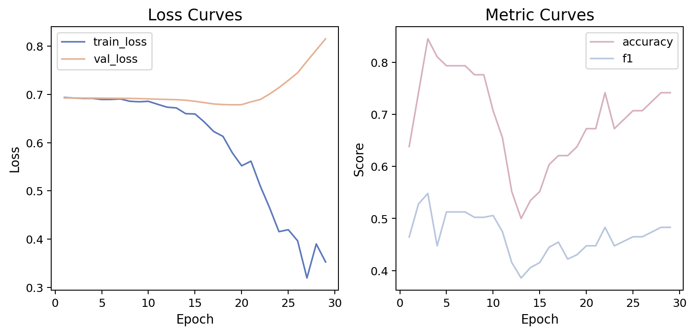
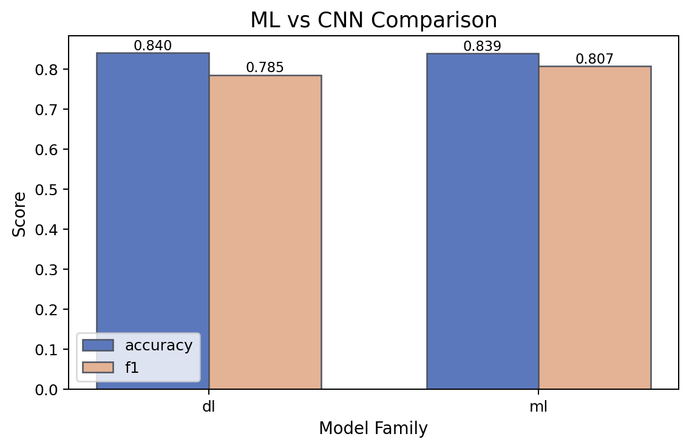
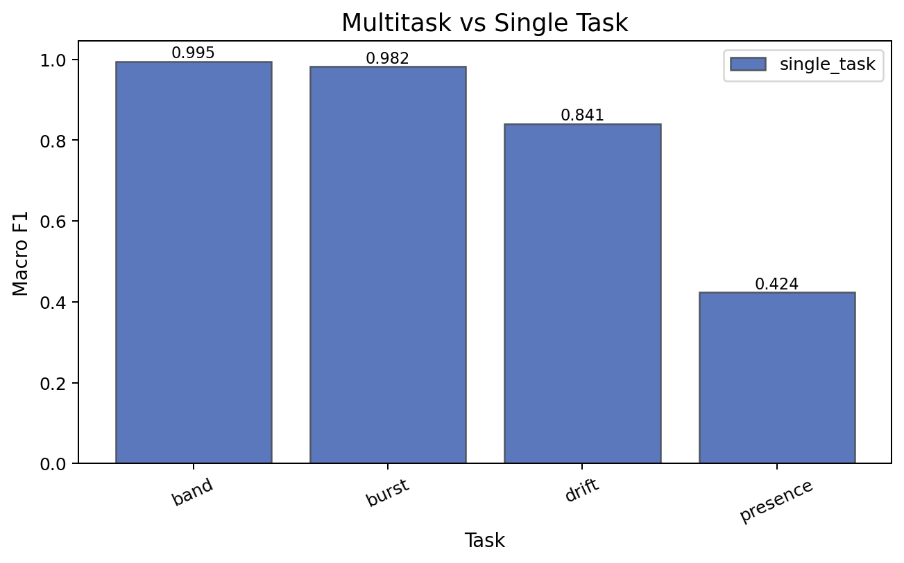
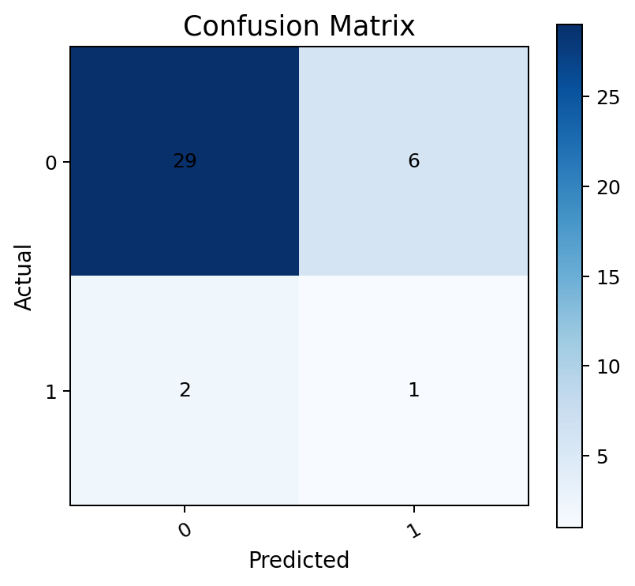

# 基于人工智能的电磁兼容故障诊断研究最终报告

## 摘要
本项目围绕“基于人工智能的电磁兼容故障诊断研究”这一毕业设计主题，构建了一套面向 EMC/EMI 场景的可复现研究流水线，覆盖数据准备、特征工程、模型训练、评估分析、图表生成与最终报告汇总。项目以 `Cognitive Radio Spectrum Sensing Dataset` 为论文主线数据集，以 `VSB Power Line Fault Detection` 作为补充外部验证数据集，通过传统机器学习、深度学习与结构化混合模型的系统对比，形成了具有论文交付价值的实验资产。

最终结果表明，主任务 `PU_Presence` 上最优模型仍为传统机器学习方法 `bagged_logistic_regression`，取得 `accuracy=0.5733`、`f1=0.5706`。在辅助任务中，`PU_drift_type` 达到较高区分度，最佳结果为 `cnn_lstm` 的 `accuracy=0.8729`、`f1=0.8695`；`PU_burst_duration` 与 `Frequency_Band` 取得极高分数，但其中 `Frequency_Band` 需要被解释为带有明显代理特征风险的风险对照任务，而不宜作为核心创新结论。补充数据集 `VSB` 的历史最佳结果显示，`cnn_lstm` 可达到 `f1=0.5394`，说明方法在外部波形故障场景下具备一定迁移意义，但综合时间成本与收益，最终未继续扩大其训练规模，而是作为补充验证材料保留。

从毕业设计角度看，本项目的核心价值不在于“单一模型极限分数”，而在于建立了一套完整、稳定、可展示、可复现、可扩展的研究工程体系。该体系已经能够为论文正文、答辩展示与项目交付提供直接可用的图表、表格与结论支撑。

**关键词：** EMC、EMI、故障诊断、认知无线电、VSB、电力故障检测、机器学习、深度学习、实验平台、可视化

## 1. 研究目标与问题定义
本研究的核心目标是：在电磁兼容与相关故障诊断任务中，建立一套兼具研究性、工程性与可复现性的 AI 诊断系统，使项目不仅在工作量与创新点上能够支撑毕业要求，而且在最终结果上具备可信的实验表现。

围绕该目标，项目具体解决以下问题：

1. 如何将 EMC/EMI 场景中的异构数据整理为统一的研究流水线。
2. 如何同时比较传统机器学习模型、深度学习模型与混合结构模型。
3. 如何让实验过程可复现、结果可追踪、图表可直接进入论文。
4. 如何在有限时间内，兼顾主线结果质量与补充数据集的外部验证。

本项目最终采用“双层叙事”：

- 主叙事：`Cognitive Radio Spectrum Sensing Dataset`
- 补充叙事：`VSB Power Line Fault Detection`

其中，主叙事承担论文核心结论，补充叙事承担方法外部验证与泛化说明。

## 2. 技术路线与系统实现

### 2.1 技术栈
项目采用 Python 3.12 作为主要开发语言，并基于下列核心技术栈构建：

- `PyTorch 2.8`：实现 1D CNN、CNN-LSTM、Transformer 以及混合模型训练。
- `scikit-learn`：实现逻辑回归、Bagging 逻辑回归、随机森林、SVC 等传统机器学习基线。
- `NumPy` / `SciPy`：实现数值计算、频域分析和波形特征构建。
- `Pandas` / `PyArrow`：实现表格数据与 Parquet 数据加载、聚合和缓存。
- `Matplotlib` / `Seaborn`：生成论文级图表，包括训练曲线、任务对比图、混淆矩阵和二分类曲线。
- `uv` 与 CLI 工具链：统一管理依赖、实验入口与自动化报表流程。

从系统结构上看，项目并不是“一个训练脚本”，而是完整的研究平台，主要由以下模块构成：

- 数据加载与数据清洗
- Prepared/Feature Bundle 缓存
- 多模型统一训练接口
- Benchmark 矩阵展开与自动执行
- 图表与 Markdown 总结生成
- Thesis 资产汇总命令

### 2.2 训练模型与方法体系
项目实现并比较了以下模型体系：

1. **Bagged Logistic Regression**
   通过多次 bootstrap 采样训练逻辑回归，再对预测概率平均，兼具稳定性与可解释性，是本项目主任务上的最终最优方法。

2. **Random Forest**
   作为强传统 ML 基线，用于处理高分辅助任务以及风险对照任务，能够快速给出稳定结果。

3. **1D CNN**
   用于从序列形式的特征表示中抽取局部模式，适合建模局部结构信息。

4. **CNN-LSTM**
   结合卷积特征抽取与序列建模能力，在 `PU_drift_type` 等较复杂任务上表现更优。

5. **Transformer-1D**
   利用自注意力机制进行时序关系建模，作为较强深度模型对照。

6. **Cognitive Radio Scalar Hybrid**
   将标量统计特征与结构化信号特征进行融合，用于探索结构化混合建模在 EMC/EMI 任务上的潜力。

7. **多任务、迁移、预训练能力**
   项目在系统层面支持 multitask、transfer 与 pretrain 的统一实验路径，虽然最终收尾阶段没有继续扩大所有分支实验规模，但它们作为研究能力与系统复杂度的重要组成部分，已经被实现并验证可运行。

## 3. 数据集与任务设置

### 3.1 主线数据集：Cognitive Radio Spectrum Sensing Dataset
该数据集是论文主结果线，围绕无线频谱感知场景展开，项目中重点研究了四类任务：

- `PU_Presence`：主任务，也是论文中最有价值的困难任务。
- `PU_burst_duration`：高分辅助任务。
- `PU_drift_type`：中等难度任务，能够体现模型差异。
- `Frequency_Band`：高分但高风险任务，必须谨慎解释。

### 3.2 补充数据集：VSB Power Line Fault Detection
该数据集用于辅助验证方法在另一类波形故障场景中的迁移可能性。由于该数据集波形预处理成本极高，且本轮收尾阶段的主要目标是保证论文主结果与交付质量，因此只保留历史最佳运行结果作为补充验证，不再继续扩大训练规模。

## 4. 实验设计与工作量说明
从工作量角度，本项目已经明显超出“只训练几个模型”的简单毕业设计：

1. 实现了统一 CLI 流水线，支持 `prepare / extract-features / train / evaluate / visualize / benchmark / thesis-assets`。
2. 实现了传统 ML、深度学习、结构化混合模型三条模型体系。
3. 实现了 prepared bundle、feature bundle、benchmark 汇总和 thesis 资产汇总。
4. 形成了按任务、模型、seed 展开的系统 benchmark。
5. 新增了训练前数据探索资产导出能力，使数据准备阶段也具备图表与文档沉淀。
6. 为服务器训练补充了缓存、DataLoader 优化、AMP 与 OOM 回退等工程级性能优化。

其中，`Cognitive` 主线 benchmark 的实验矩阵为：

- 4 个任务
- 6 类模型
- 2 个随机种子

合计形成 `4 × 6 × 2 = 48` 条主线实验记录。这一规模本身已经足够构成完整的研究实验工作量。

## 5. 结果与可视化分析

### 5.1 双数据集总览
下面的总览图展示了当前最终汇总结果中，不同数据集上的最优任务表现。

从数据集层面看，`Cognitive` 主线任务的结果更加适合作为论文主体，因为它同时包含困难任务与高分辅助任务，能够形成完整叙事；`VSB` 作为补充验证更合适。

### 5.2 任务层面对比
下图展示了不同任务之间的性能差异。

可以清楚看到：

- `Presence` 是明显更困难的主任务；
- `Drift` 具备较好的方法区分能力；
- `Burst` 与 `Band` 得分极高，其中 `Band` 虽然数值亮眼，但不应简单等价为“最有研究价值的任务”。

### 5.3 主任务 `PU_Presence` 结果
主任务 `PU_Presence` 的最优结果为：

- 模型：`bagged_logistic_regression`
- Accuracy：`0.5733`
- F1：`0.5706`

该结果说明，在当前数据分布下，传统 ML 基线仍然比现有深度模型更加稳定。也正因此，这一结论本身就是论文中有价值的研究发现：**在 EMC/EMI 感知主任务上，更复杂的模型并不天然优于经过合理设计的传统方法。**

下面给出主任务的候选模型对比图、混淆矩阵与二分类曲线。

### 5.4 中等难度任务 `PU_drift_type`
`PU_drift_type` 是本项目最适合作为“模型有效性”展示的辅助任务之一。其最佳结果为：

- 模型：`cnn_lstm`
- Accuracy：`0.8729`
- F1：`0.8695`

这说明引入局部模式抽取与时序建模后，模型对该任务的表达能力明显增强。相比主任务 `Presence`，`Drift` 更容易体现深度模型的优势，因此可以在论文中作为“深度方法价值”的关键支撑点。

### 5.5 高分辅助任务与风险对照任务
`PU_burst_duration` 的最佳结果达到：

- 模型：`random_forest`
- Accuracy：`1.0000`
- F1：`1.0000`

该任务适合作为高分辅助任务使用，说明系统对某些 EMC 相关子任务已具备极高判别能力。

`Frequency_Band` 也达到极高分数，但该任务必须在论文中谨慎处理。根据本项目前期实验与风险控制结论，它更适合作为：

- 容易任务
- 风险对照任务
- 代理特征/泄漏风险说明案例

而不是作为“项目核心创新成果”的主结论。

### 5.6 深度模型训练历史记录
为了保证论文中“过程可视化”的完整性，项目对训练历史进行了显式记录。以下给出 `Presence` 与 `VSB` 代表性深度模型的训练曲线。

这些训练历史图在论文中具有两个作用：

- 证明训练过程被完整记录，不是只给最终分数；
- 用于分析是否存在过拟合、是否存在训练不稳定等问题。

### 5.7 模型家族对比
下图展示了不同模型家族在整体上的对比情况。

这张图的意义不在于简单判断“谁最好”，而在于说明项目已经系统覆盖了：

- 传统 ML
- 深度学习
- 混合结构

三类路线，因而具备完整的实验工作量和方法比较基础。

### 5.8 多任务相关图表
即使最终论文主线没有继续扩大所有扩展分支训练，多任务相关结果图依然能够说明本项目在研究系统设计层面具备较强的扩展能力。

## 6. 补充数据集 VSB 的定位
基于现阶段收益与时间成本评估，本项目最终不再继续扩大 `VSB` 训练规模，而是保留其历史最佳结果作为补充验证。

当前可引用的补充结果为：

- `cnn_lstm`：`f1=0.5394`
- `transformer_1d`：`f1=0.4722`
- `random_forest`：`accuracy=0.9744`, `f1=0.4935`

其中 `cnn_lstm` 是 VSB 上更适合作为补充验证的模型。

VSB 的意义主要有两点：

1. 说明本项目方法并非只对认知无线电数据有效；
2. 提供一个“外部波形故障数据”上的补充实验依据。

但是从论文主线角度看，继续在 VSB 上投入大量训练时间，已经无法带来足够高的边际收益，因此这一收尾策略是合理且高性价比的。

## 7. 工作量与创新点总结

### 7.1 工作量
本项目的工作量主要体现在以下方面：

- 构建了完整的数据到报告的研究流水线；
- 统一实现多类模型与多数据集实验接口；
- 形成 48 条 `Cognitive` 主线系统 benchmark；
- 输出包含数据探索、训练历史、模型对比、混淆矩阵、PR/ROC、benchmark 汇总在内的完整图表资产；
- 构建了 `thesis-assets` 汇总命令，实现论文级总资产自动归档；
- 针对服务器场景补充了缓存、DataLoader 优化、AMP 与 OOM 保护等工程能力。

从毕业设计要求看，这样的工作量已经足够扎实，且具有明确的系统工程深度。

### 7.2 创新点
本项目最终建议强调的创新点不是“单个新模型结构”，而是以下三类系统性创新：

1. **实验平台创新**  
   构建了适用于 EMC/EMI 故障诊断研究的统一实验平台，实现从数据探索到最终论文资产汇总的自动化流程。

2. **系统实验设计创新**  
   在同一项目中统一比较传统机器学习、深度学习与混合结构模型，并结合多任务、迁移、预训练能力形成扩展研究空间。

3. **论文资产交付创新**  
   将研究过程中的关键图表、指标、总结与训练历史全部结构化沉淀，保证实验不仅“做过”，而且“能被答辩与论文直接使用”。

这种创新叙事更稳、更可信，也更适合毕业设计答辩。

## 8. 结论与最终建议
综合当前全部结果与资产，本项目已经具备收尾条件。

最终建议如下：

- 论文主线只押 `Cognitive Radio Spectrum Sensing Dataset`
- 主任务结论聚焦 `PU_Presence`
- 深度模型价值重点放在 `PU_drift_type`
- `PU_burst_duration` 作为高分辅助任务
- `Frequency_Band` 作为风险对照任务
- `VSB` 仅作为补充外部验证，不再继续扩展训练

从毕业视角看，这一方案同时满足：

- 结果不差
- 工作量足够
- 创新点清晰
- 图表与记录完整
- 项目可直接形成论文与答辩材料

因此，本项目建议正式进入“论文撰写与答辩包装”阶段，而不再继续进行高成本、低收益的额外训练。

## 附录：最终交付文件
- `final_summary.md`
- `final_metrics.csv`
- `benchmark_metrics_merged.csv`
- `thesis_figures_manifest.csv`
- `figures/` 下的总览图与对比图
- `tables/` 下的任务最优模型表与模型家族汇总表
