# 数据探索图册

本文件汇总了论文写作需要用到的训练前探索图，避免在 prepared 目录和 runs 目录之间来回查找。

### pu_presence_main

- Source: `artifacts/prepared_cognitive_presence`

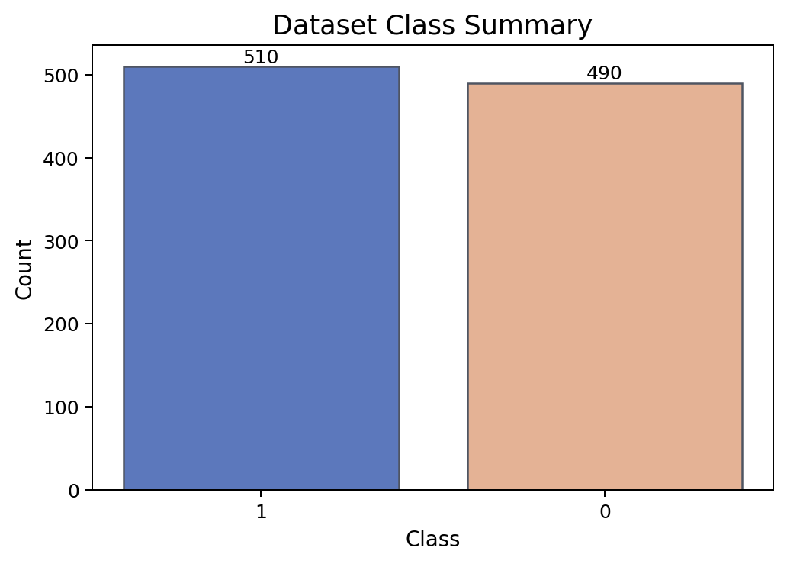

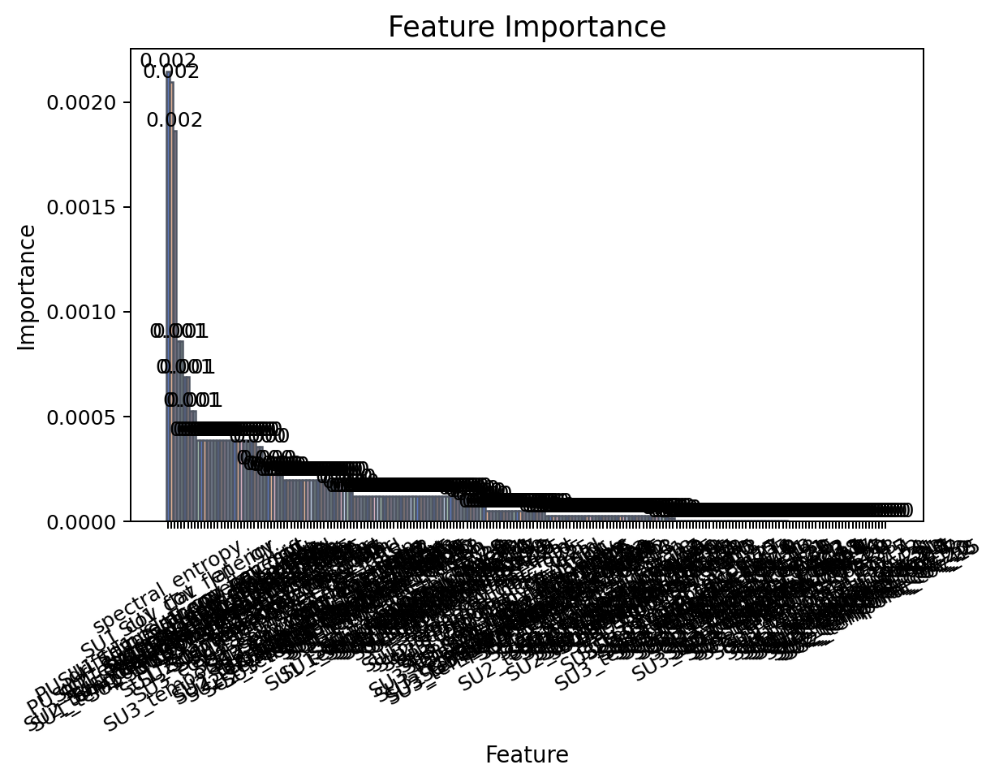

### pu_burst_duration_aux

- Source: `artifacts/prepared_cognitive_burst_duration`

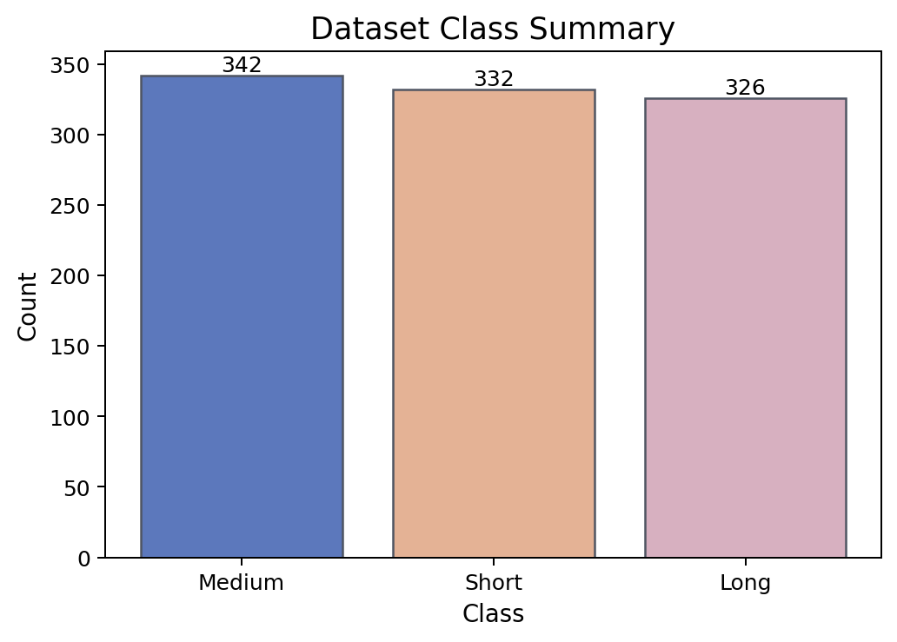

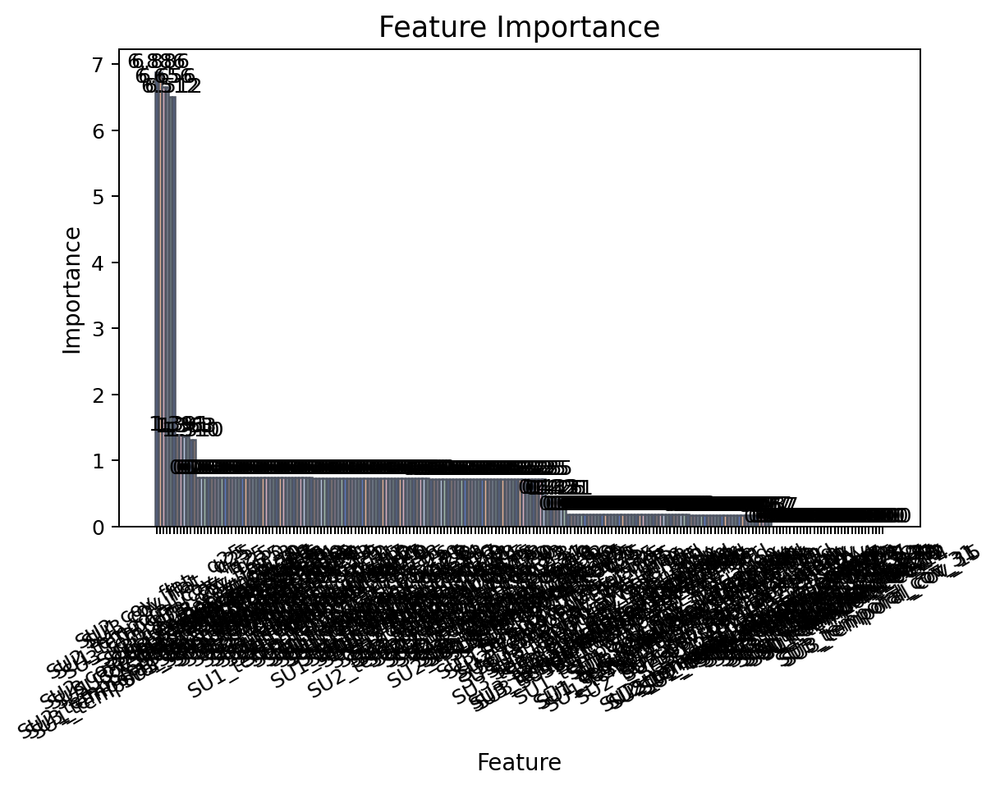

### pu_drift_type_mid

- Source: `artifacts/prepared_cognitive_drift_type`

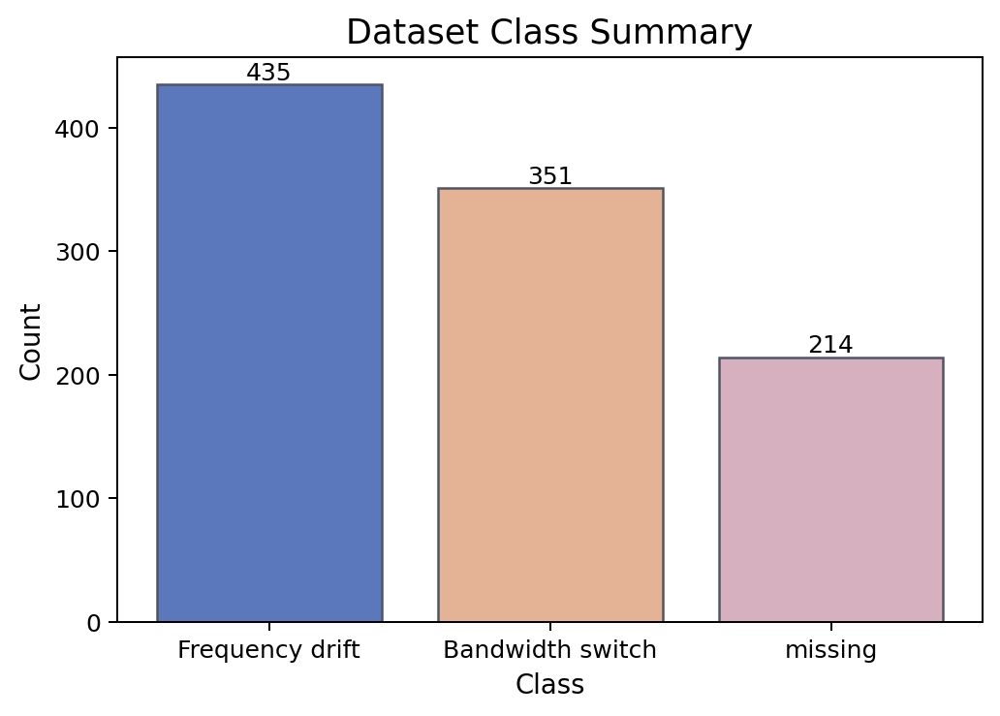

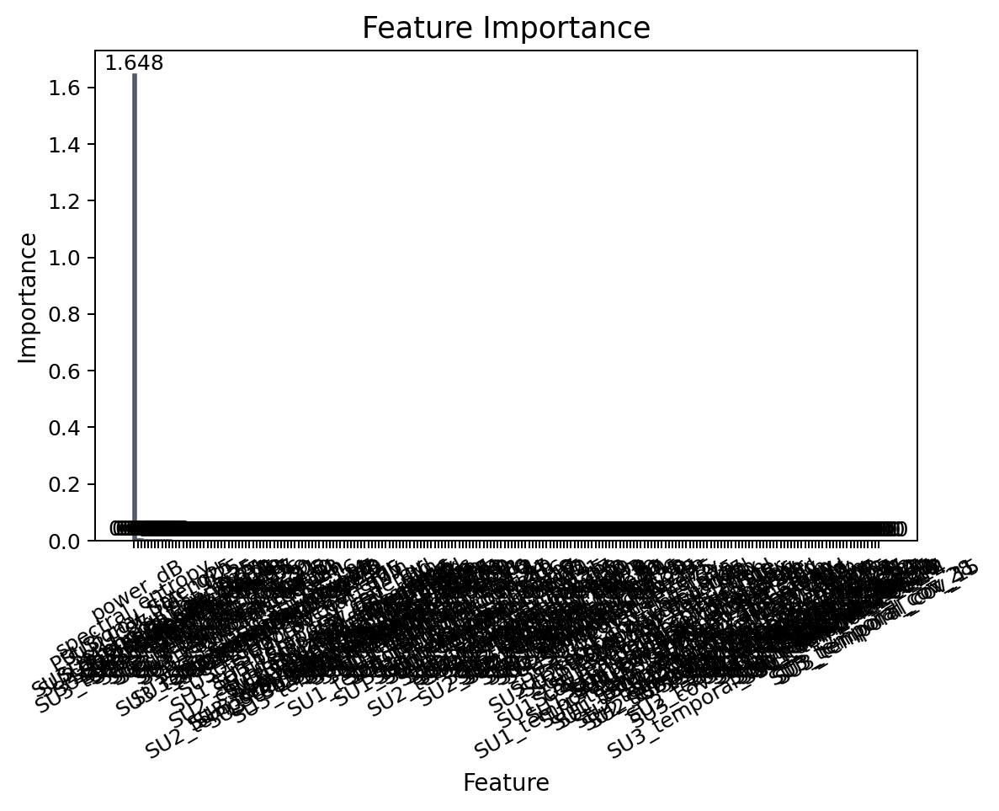

### frequency_band_aux

- Source: `artifacts/prepared_cognitive_frequency_band`

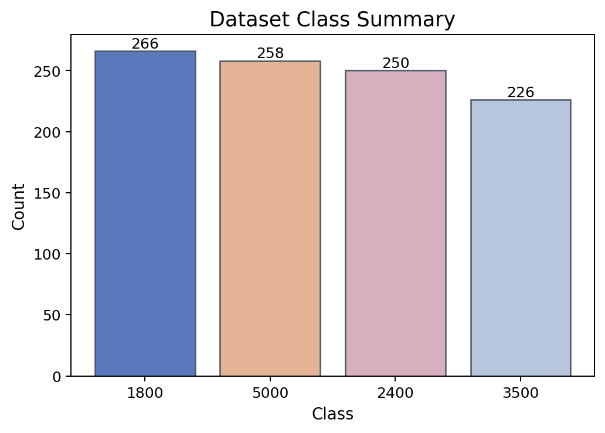

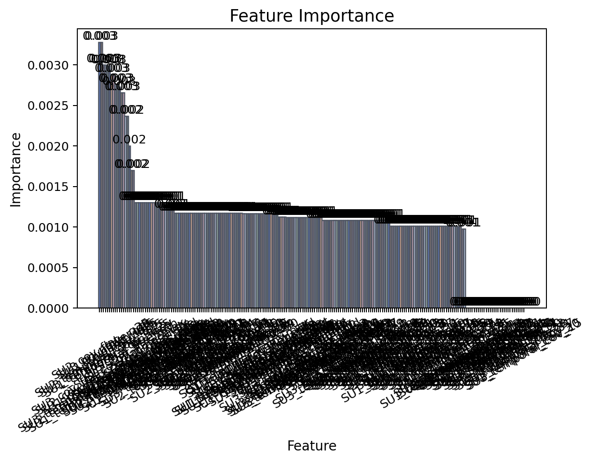

### vsb_fault_detection_smoke

- Source: `artifacts/prepared_vsb_fault_detection`

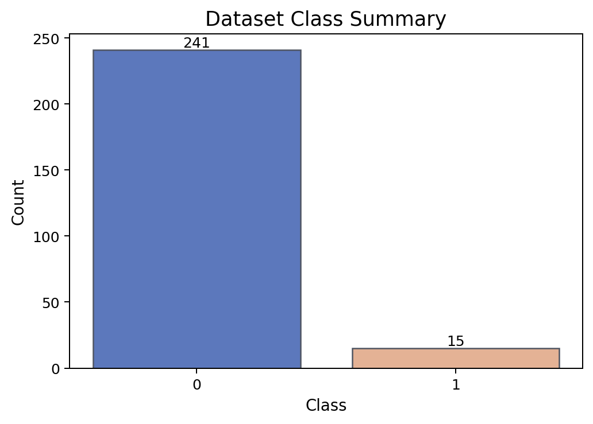

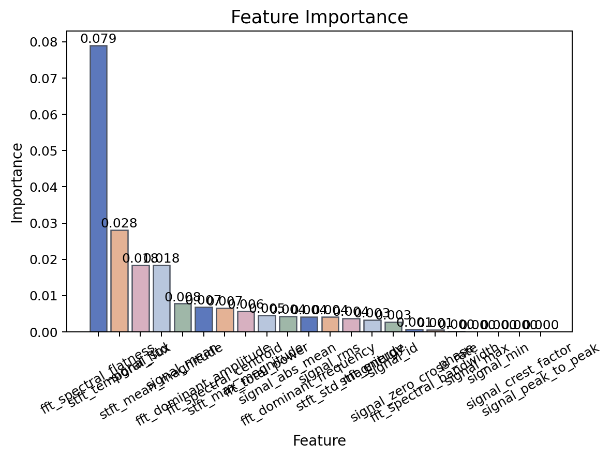

### vsb_fault_cnn_lstm_main

- Source: `artifacts/prepared_vsb_fault_cnn_lstm`

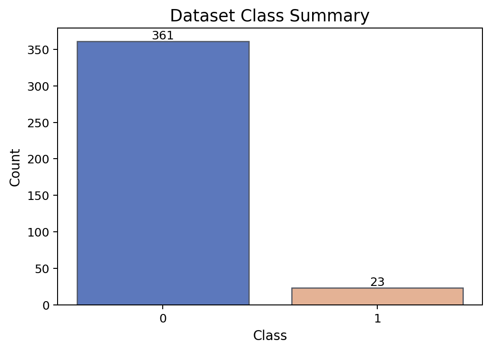

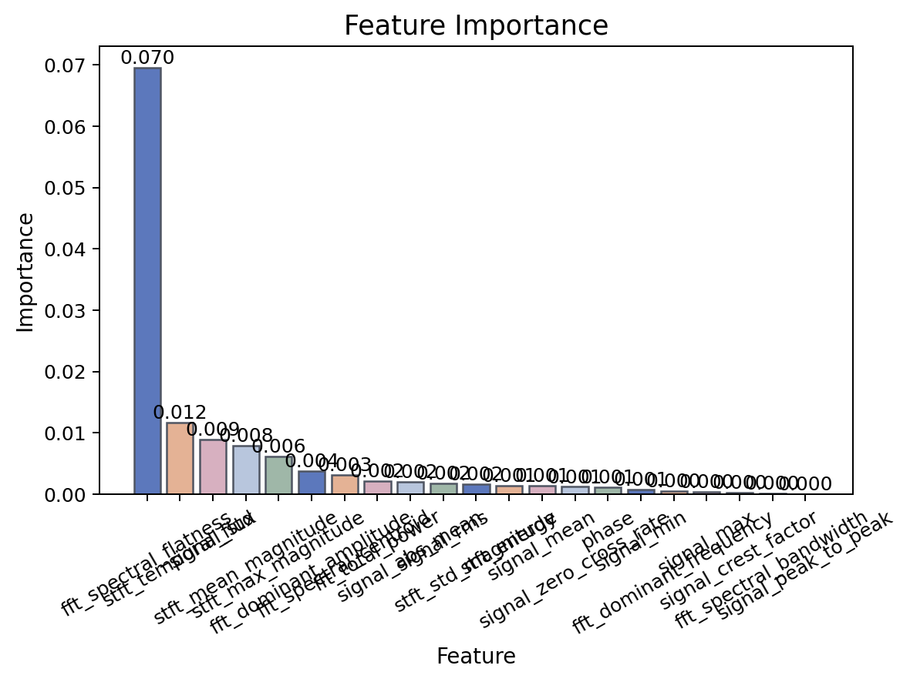
