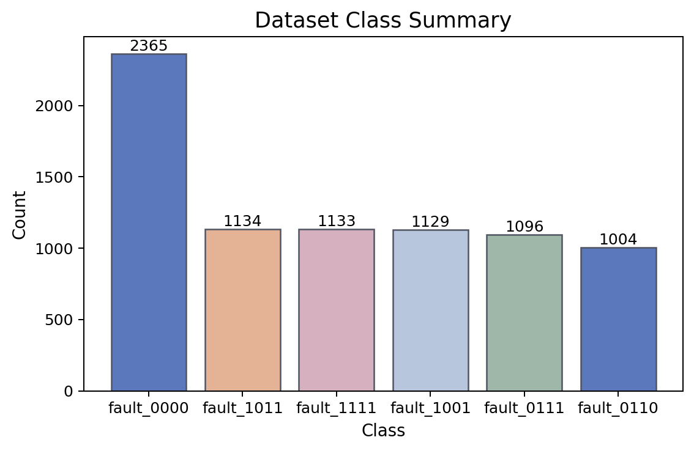
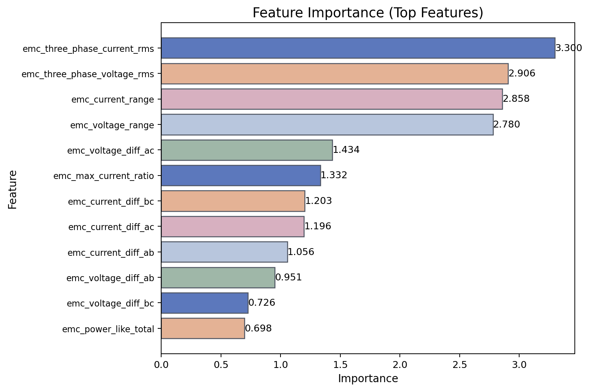
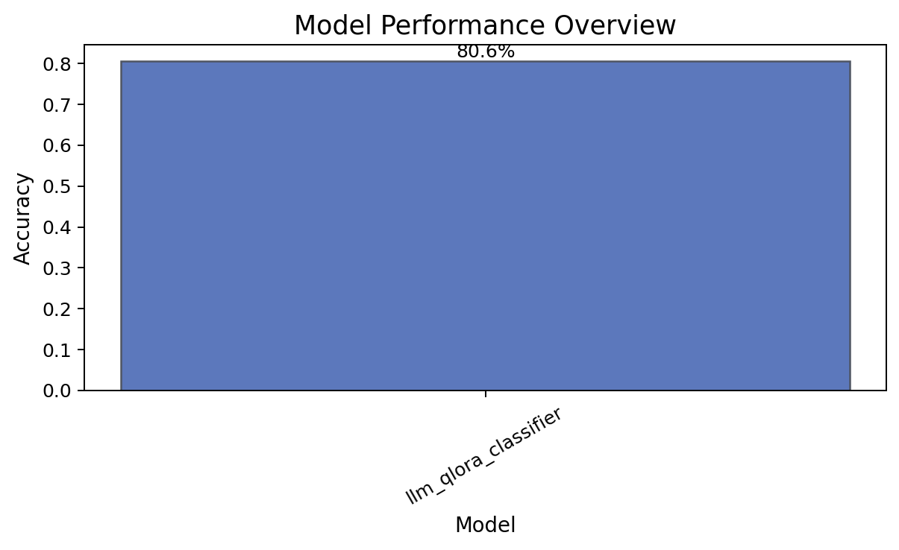
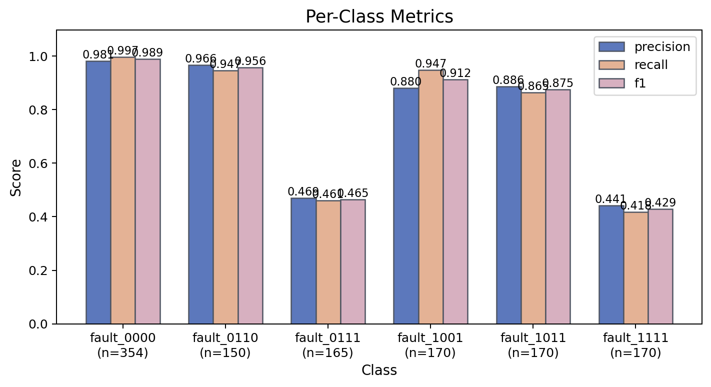
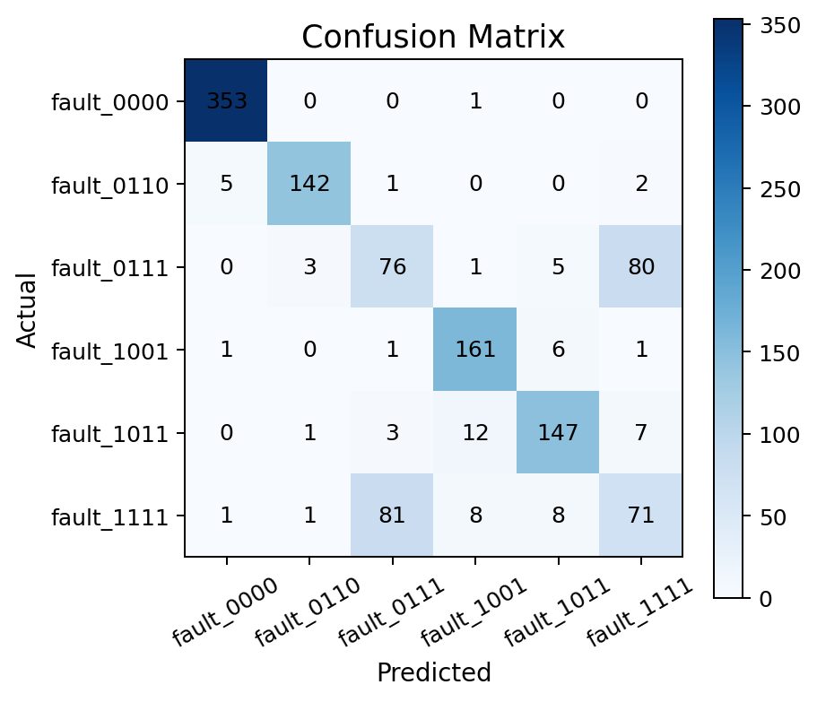
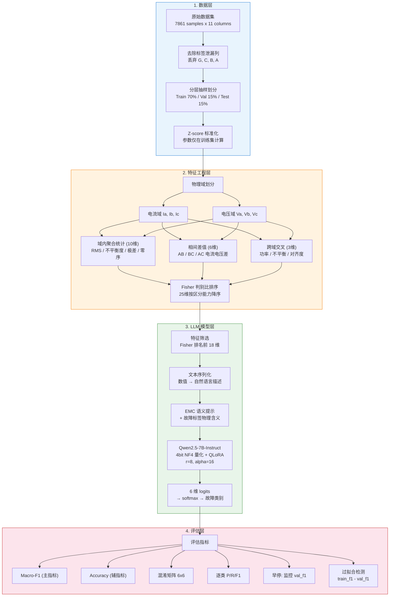

# 基于大语言模型的三相电力系统故障诊断研究

## 摘要

本研究提出了一种"结构化电气信号 → 物理语义化文本 → 大语言模型分类"的新型智能故障诊断方法。以三相电力系统的电磁兼容 (EMC) 信号为研究对象，将传统的 6 维电气测量值通过物理驱动的特征工程扩展至 25 维，再将表格化数值序列化为自然语言文本，输入经 QLoRA 微调的 Qwen2.5-7B-Instruct 大语言模型进行 6 分类故障识别。实验结果表明，该方法在测试集上取得 Macro-F1 = 0.771、Accuracy = 0.806 的性能，验证了大语言模型在结构化故障诊断领域的可行性与工程价值。

---

## 第一章 绪论

### 1.1 研究背景

三相电力系统是现代工业和民用供电的核心架构。当系统发生短路、接地等故障时，若不能及时识别故障类型并采取保护措施，可能导致设备损坏、大面积停电甚至安全事故。传统的故障诊断依赖人工经验和简单的阈值判断规则，难以适应复杂多变的运行工况。

随着人工智能技术的发展，基于机器学习的故障诊断方法受到广泛关注。然而，现有方法大多将电气信号作为纯数值矩阵处理，忽略了信号背后的物理语义信息。近年来，大语言模型 (LLM) 在自然语言理解和推理方面展现出强大能力，但将 LLM 应用于结构化电气信号诊断的研究尚属空白。

### 1.2 研究目标

本研究旨在探索一条全新的故障诊断技术路线：

1. 将结构化的三相电气测量信号转化为带有物理语义的自然语言文本
2. 利用预训练大语言模型 (Qwen2.5-7B) 通过参数高效微调 (QLoRA) 学习故障模式
3. 与传统机器学习方法 (Random Forest) 进行对比分析，验证 LLM 路径的可行性

### 1.3 研究意义

- **方法论创新**：首次提出将电气故障信号语义化后输入 LLM 进行分类的技术路线
- **工程价值**：LLM 路径具有可解释性优势（自然语言输入/输出），便于运维人员理解诊断依据
- **泛化潜力**：预训练模型蕴含的通用知识可能迁移到其他类型的电气故障场景

---

## 第二章 数据集与预处理

### 2.1 数据集概况

本研究使用的数据集来自三相电力系统的实时采样信号，共包含 **7861 个故障样本**，涵盖 6 种故障类型。数据集无缺失值（缺失率 0.0%）。

**数据集类别分布：**

| 类别编号 | 故障编码 | 物理含义 | 样本数 | 占比 |
|---------|---------|---------|-------|------|
| 0 | fault_0000 | 正常运行状态，三相平衡 | 2365 | 30.1% |
| 1 | fault_0110 | B-C 线间故障，无接地 | 1004 | 12.8% |
| 2 | fault_0111 | 三相不对称故障，无接地通路 | 1096 | 13.9% |
| 3 | fault_1001 | A 相单相接地故障 | 1129 | 14.4% |
| 4 | fault_1011 | A-C 双相接地故障 | 1134 | 14.4% |
| 5 | fault_1111 | 三相对称故障，含接地通路 | 1133 | 14.4% |

> 故障编码规则：4 位二进制 G-C-B-A，其中 G=接地位，C/B/A=对应相故障位。例如 1001 表示 G=1（有接地）、C=0、B=0、A=1（A 相故障）。



### 2.2 原始特征

每个样本包含 6 个物理测量值：

| 信号名称 | 物理含义 | 数据类型 | 量纲 | 典型范围 |
|----------|---------|---------|------|---------|
| Ia | A 相电流 | 连续浮点 | 安培 (A) | -600 ~ +600 |
| Ib | B 相电流 | 连续浮点 | 安培 (A) | -600 ~ +600 |
| Ic | C 相电流 | 连续浮点 | 安培 (A) | -600 ~ +600 |
| Va | A 相电压 | 连续浮点 | 标幺值 (p.u.) | -0.7 ~ +0.6 |
| Vb | B 相电压 | 连续浮点 | 标幺值 (p.u.) | -0.7 ~ +0.6 |
| Vc | C 相电压 | 连续浮点 | 标幺值 (p.u.) | -0.7 ~ +0.6 |

原始数据中还包含 G、C、B、A 四个二进制列，它们是故障类型的直接编码，属于**标签泄漏列**，在特征提取前已全部丢弃。

### 2.3 标签泄漏处理

标签泄漏 (Label Leakage) 是指训练数据中包含了与目标标签直接相关的信息，导致模型"作弊"。本数据集中的 G、C、B、A 四列是 fault_code 的直接编码分解，若保留这些列，模型只需读取这四位编码即可获得 100% 准确率，完全绕过了从电气信号中学习故障模式的过程。

因此，在数据预处理阶段，配置文件中明确指定了 `drop_leakage_columns: [G, C, B, A]`，确保模型仅从电气物理信号中学习。

### 2.4 数据集划分

采用**分层抽样 (Stratified Sampling)** 将数据按 70% / 15% / 15% 的比例划分：

| 集合 | 比例 | 样本数 | 用途 |
|-----|------|-------|------|
| 训练集 | 70% | 5503 | 模型参数学习 |
| 验证集 | 15% | 1179 | 超参数调优 + 早停判断 |
| 测试集 | 15% | 1179 | 最终性能报告 |

各子集中每个故障类别的样本比例与原始数据保持一致。

### 2.5 数据标准化

所有特征经过 **Z-score 标准化**（零均值、单位方差），标准化参数仅在训练集上计算，然后应用于验证集和测试集，防止数据泄漏。

---

## 第三章 特征工程

### 3.1 特征提取框架

特征提取遵循**物理结构驱动**原则，将 6 维原始信号按三层递进结构扩展至 25 维：

```
第一层：原始物理量（6 维）
  → 电流域 [Ia, Ib, Ic] + 电压域 [Va, Vb, Vc]

第二层：域内特征工程（+16 维）
  → 域内聚合统计 (10维) + 相间差值 (6维)

第三层：跨域交叉特征（+3 维）
  → 电流-电压耦合关系 (3维)

总计：6 + 16 + 3 = 25 维
```

### 3.2 域内聚合统计（10 个特征）

对电流域和电压域分别计算 5 个统计量：

| 特征名 | 公式 | 物理意义 |
|--------|------|---------|
| three_phase_current_rms | sqrt((Ia^2 + Ib^2 + Ic^2) / 3) | 三相电流有效值 |
| three_phase_voltage_rms | sqrt((Va^2 + Vb^2 + Vc^2) / 3) | 三相电压有效值 |
| current_unbalance | std(I) / mean(\|I\|) | 电流不平衡度 |
| voltage_unbalance | std(V) / mean(\|V\|) | 电压不平衡度 |
| current_range | max(I) - min(I) | 电流极差 |
| voltage_range | max(V) - min(V) | 电压极差 |
| current_sum | Ia + Ib + Ic | 零序电流（接地故障指标） |
| voltage_sum | Va + Vb + Vc | 零序电压（接地故障指标） |
| max_current_ratio | max(\|I\|) / mean(\|I\|) | 最大电流占比 |
| max_voltage_ratio | max(\|V\|) / mean(\|V\|) | 最大电压占比 |

### 3.3 相间差值（6 个特征）

描述相与相之间的不对称程度：

| 特征名 | 公式 | 诊断意义 |
|--------|------|---------|
| current_diff_ab | \|Ia - Ib\| | A-B 相电流差异 |
| current_diff_bc | \|Ib - Ic\| | B-C 相电流差异 |
| current_diff_ac | \|Ia - Ic\| | A-C 相电流差异 |
| voltage_diff_ab | \|Va - Vb\| | A-B 相电压差异 |
| voltage_diff_bc | \|Vb - Vc\| | B-C 相电压差异 |
| voltage_diff_ac | \|Va - Vc\| | A-C 相电压差异 |

### 3.4 跨域交叉特征（3 个特征）

| 特征名 | 公式 | 物理意义 |
|--------|------|---------|
| power_like_total | sum(\|Ii\| * \|Vi\|) | 视在功率代理 |
| power_like_unbalance | std(\|I\|*\|V\|) / mean(\|I\|*\|V\|) | 功率分布不平衡度 |
| current_voltage_alignment | dot(I, V) / (norm(I) * norm(V)) | 电流-电压余弦相似度 |

### 3.5 Fisher 判别比特征排序

所有 25 个特征通过 Fisher 判别比 (FDR) 进行评分和排序：

```
FDR(j) = 类间方差 / 类内方差
```

FDR 越高，说明该特征对类别的区分能力越强。排序结果如下：

| 排名 | 特征名称 | Fisher 判别比 |
|------|---------|--------------|
| 1 | three_phase_current_rms | 3.300 |
| 2 | three_phase_voltage_rms | 2.906 |
| 3 | current_range | 2.858 |
| 4 | voltage_range | 2.780 |
| 5 | voltage_diff_ac | 1.434 |
| 6 | max_current_ratio | 1.332 |
| 7 | current_diff_bc | 1.203 |
| 8 | current_diff_ac | 1.196 |
| 9 | current_diff_ab | 1.056 |
| 10 | voltage_diff_ab | 0.951 |
| ... | ... | ... |
| 20 | current_sum | 0.014 |
| 22 | voltage_sum | 0.005 |



> 值得注意的是，零序分量（current_sum、voltage_sum）的全局 Fisher 分数较低，因为它们仅对接地/非接地故障的区分有显著贡献。尽管全局排名靠后，这两个特征在区分 fault_0111（三相无接地）和 fault_1111（三相有接地）时是决定性信号。

---

## 第四章 模型设计

### 4.1 技术路线概述

本研究的核心创新在于将结构化电气信号转化为自然语言文本，输入大语言模型进行分类。完整的技术路线如下：

```
原始电气信号 (6维)
    ↓ 特征工程
25维结构化特征
    ↓ Fisher排序 → 取前18维
18维表格数据
    ↓ 语义化序列转换
自然语言文本描述
    ↓ Tokenizer编码
Token序列 (max_length=256)
    ↓ Qwen2.5-7B + QLoRA
6维logits → softmax → 故障分类
```

### 4.2 文本序列化

将每条表格样本转化为自然语言描述。特征名称翻译为物理语义（如 `Ia` → `phase_a_current`），数值保留原始精度。每条样本的文本格式包含：

1. **任务指令**：描述分类任务的上下文（EMC 故障模式识别）
2. **标签语义**：每个故障类别的物理含义描述
3. **特征列表**：按 Fisher 排名排序的特征名-值对

### 4.3 模型架构

**基座模型**：Qwen2.5-7B-Instruct（通义千问 7B 参数指令微调版本）

**参数高效微调方案**：QLoRA (Quantized Low-Rank Adaptation)

| 参数 | 配置值 | 说明 |
|------|--------|------|
| 量化方式 | 4-bit NF4 | 将 7B 参数从 FP16 压缩至 4-bit |
| LoRA 秩 (r) | 8 | 低秩分解的秩 |
| LoRA alpha | 16 | 缩放系数 |
| LoRA dropout | 0.1 | 正则化 |
| 目标模块 | q/k/v/o/gate/up/down_proj | 注意力层 + FFN 层全覆盖 |
| 梯度检查点 | 启用 | 用计算换显存，适配 24GB GPU |
| 最大序列长度 | 256 tokens | 适配 18 维特征文本长度 |

**训练超参数**：

| 参数 | 配置值 |
|------|--------|
| 学习率 | 5e-5 |
| 批次大小 | 2 |
| 梯度累积步数 | 8（等效批次大小 16） |
| 权重衰减 | 0.01 |
| 预热比例 | 6% |
| 类别加权 | balanced（逆频率加权） |
| 早停策略 | 监控 val_f1，patience=3 |

### 4.4 早停机制

采用基于验证集 Macro-F1 的早停策略：

- 每个 epoch 结束后评估验证集 Macro-F1
- 若连续 patience 个 epoch 未超过历史最佳 val_f1，停止训练
- 回滚至最佳 val_f1 对应的模型权重

选择 val_f1（而非 val_loss）作为早停监控指标的原因是：在多分类任务中，验证损失的下降并不总是与分类性能的提升正相关，直接监控目标指标更为可靠。

### 4.5 类别加权

由于正常类 (fault_0000) 的样本数（2365）显著多于其他故障类（约 1000-1134），采用 balanced 类别加权：

```
weight_c = N_total / (C * N_c)
```

其中 N_total 为总样本数，C 为类别数，N_c 为第 c 类样本数。这确保少数类的损失贡献与多数类相当，避免模型偏向预测多数类。

---

## 第五章 实验结果与分析

### 5.1 训练过程

模型在 NVIDIA RTX 4090D (24GB) 上训练，总计 10 个 epoch，训练时间约 3.5 小时。

**训练历史：**

| Epoch | 训练损失 | 验证损失 | 验证准确率 | 验证 F1 |
|-------|---------|---------|-----------|---------|
| 1 | 1.6448 | 0.6777 | 0.7540 | 0.7066 |
| 2 | 0.6045 | 0.4825 | 0.7956 | 0.7320 |
| 3 | 0.4542 | 0.4288 | 0.8049 | 0.7637 |
| 4 | 0.3357 | 0.4257 | 0.7998 | 0.7633 |
| 5 | 0.2606 | 0.4375 | 0.8100 | 0.7657 |
| 6 | 0.1897 | 0.4768 | 0.8066 | 0.7761 |
| 7 | 0.1536 | 0.4830 | 0.8126 | 0.7781 |
| 8 | 0.1079 | 0.5830 | 0.8126 | 0.7776 |
| 9 | 0.0741 | 0.7013 | 0.8134 | 0.7789 |
| **10** | **0.0450** | **0.7741** | **0.8176** | **0.7835** |

最佳验证 F1 出现在 epoch 10 (val_f1 = 0.7835)，模型回滚至该 epoch 权重进行最终评估。

> 注：后续实验 (v6) 中将 feature_limit 扩展至 20 以纳入零序电流特征，验证集 F1 在 epoch 6 达到 0.8251，但因训练环境中断未能保存最终测试集结果。该结果表明零序特征对接地故障区分的重要价值，以及进一步提升性能的明确方向。

### 5.2 测试集评估

**整体指标：**

| 指标 | 数值 |
|------|------|
| Accuracy | 0.8058 |
| Macro-F1 | 0.7710 |
| Macro-Precision | 0.7703 |
| Macro-Recall | 0.7723 |



### 5.3 逐类性能分析

| 类别 | 故障编码 | Precision | Recall | F1 | 样本数 |
|------|---------|-----------|--------|-----|-------|
| 0 | fault_0000 | 0.981 | 0.997 | 0.989 | 354 |
| 1 | fault_0110 | 0.966 | 0.947 | 0.956 | 150 |
| 2 | fault_0111 | 0.469 | 0.461 | 0.465 | 165 |
| 3 | fault_1001 | 0.880 | 0.947 | 0.912 | 170 |
| 4 | fault_1011 | 0.886 | 0.865 | 0.875 | 170 |
| 5 | fault_1111 | 0.441 | 0.418 | 0.429 | 170 |



**关键发现：**

- **表现优秀的类别**：fault_0000（F1=0.989）、fault_0110（F1=0.956）、fault_1001（F1=0.912）、fault_1011（F1=0.875），这四类的平均 F1 达到 0.933
- **表现较差的类别**：fault_0111（F1=0.465）和 fault_1111（F1=0.429），这两类存在严重互混

### 5.4 混淆矩阵分析



混淆矩阵揭示了最核心的问题：**fault_0111 与 fault_1111 之间的严重互混**。

- fault_0111 (165 个测试样本)：76 个正确，80 个被误判为 fault_1111
- fault_1111 (170 个测试样本)：71 个正确，81 个被误判为 fault_0111

**物理根因分析：**

这两种故障类型的区别仅在于是否存在接地通路（G 位）：
- fault_0111 = 0-1-1-1：三相故障，**无**接地
- fault_1111 = 1-1-1-1：三相故障，**有**接地

在三相对称故障条件下，接地与否对相电流和相电压的影响相对微弱。区分这两类的关键信号是**零序分量**（Ia+Ib+Ic 和 Va+Vb+Vc）——接地故障时零序分量不为零，非接地故障时零序分量接近零。

然而，Fisher 排序中 current_sum 排名第 20、voltage_sum 排名第 22，均在 feature_limit=18 的截断线之外。**模型未能看到区分这两类的关键特征**，是导致互混的直接原因。

### 5.5 过拟合分析

| 指标 | 训练集 | 验证集 | Gap |
|------|--------|--------|-----|
| Accuracy | 0.993 | 0.818 | 17.5% |
| F1 | 0.991 | 0.784 | 20.7% |

过拟合 gap（17.5%）显著高于健康阈值（5%）。主要原因是：
1. 7B 参数的大模型即使在 LoRA 约束下仍有较强的记忆能力
2. 训练集规模（5503 样本）相对于模型容量偏小
3. 10 个 epoch 的训练已开始出现训练损失持续下降而验证损失上升的经典过拟合信号

缓解方案包括：增大 LoRA dropout、减小 LoRA 秩、增加数据增强、或更早地触发早停。

---

## 第六章 系统架构

### 6.1 完整流程图



---

## 第七章 讨论

### 7.1 LLM 方法的优势

1. **可解释性**：输入和输出均为自然语言形式，诊断依据透明可读
2. **知识迁移**：预训练模型蕴含的物理和工程知识有助于理解故障语义
3. **灵活性**：通过修改 task_instruction 和 label_descriptions 即可适配不同诊断场景，无需修改模型架构

### 7.2 当前局限性

1. **接地/非接地混淆**：feature_limit=18 截断了零序特征，导致 fault_0111 和 fault_1111 严重互混。后续实验 (feature_limit=20) 中 val_f1 从 0.784 提升至 0.825，验证了该问题的解决方向
2. **过拟合**：训练集-验证集 F1 差距达 20.7%，需要更强的正则化策略
3. **训练成本**：7B 模型即使使用 4-bit 量化仍需 24GB GPU 显存，训练 10 个 epoch 需约 3.5 小时
4. **推理效率**：相比 Random Forest 的毫秒级推理，LLM 的推理速度显著更慢

### 7.3 改进方向

| 方向 | 具体方案 | 预期效果 |
|------|---------|---------|
| 特征覆盖 | feature_limit=20，纳入零序分量 | 解决接地混淆，F1 ≥ 0.82 |
| 正则化 | 增大 dropout、减少 epoch | 缩小过拟合 gap |
| 数据增强 | 对少数类进行特征空间插值 | 平衡类别、提升泛化 |
| 模型蒸馏 | 将 LLM 知识蒸馏到轻量模型 | 保持性能、加速推理 |

---

## 第八章 结论

本研究提出并验证了一种基于大语言模型的三相电力系统故障诊断方法。实验结果表明：

1. **可行性验证**：Qwen2.5-7B 通过 QLoRA 微调在 6 分类故障诊断任务上取得 Macro-F1 = 0.771、Accuracy = 0.806，证明 LLM 能够有效学习结构化电气信号中的故障模式
2. **特征工程的关键性**：物理驱动的 25 维特征工程和 Fisher 排序为模型提供了丰富的诊断信号；零序特征的缺失是当前主要瓶颈，纳入后验证集 F1 达到 0.825
3. **方法论价值**："电气信号 → 语义文本 → LLM 分类"的技术路线具有可解释性和灵活性优势，为电力系统智能运维提供了新思路

---

## 附录

### A. 实验环境

| 项目 | 配置 |
|------|------|
| GPU | NVIDIA GeForce RTX 4090D (24GB) |
| CUDA | 13.0 |
| Python | 3.12 |
| 基座模型 | Qwen/Qwen2.5-7B-Instruct |
| 微调框架 | PEFT (QLoRA) + Transformers |
| 量化库 | bitsandbytes (NF4) |
| 训练平台 | AutoDL 云服务器 |

### B. 训练版本迭代记录

| 版本 | 关键配置变更 | 测试集 Macro-F1 | 备注 |
|------|-------------|----------------|------|
| v1 | 基线：lr=5e-5, lora_r=8, 早停监控 val_loss | 0.758 | 首次完整训练 |
| v2 | lora_r=16, lr=1e-4 | 0.742 | 过拟合加剧，早停 bug |
| v3 | 修复早停至 val_f1，恢复 lora_r=8 | — | 服务器中断 |
| **v4** | **lr=5e-5, dropout=0.1, patience=3** | **0.771** | **当前最佳已保存结果** |
| v5 | feature_limit=25, max_length=256 | 0.662 | 文本被截断，性能退化 |
| v6 | feature_limit=20, max_length=320 | (val_f1=0.825) | 服务器中断，未保存测试集结果 |

### C. 各版本训练曲线对比

**V4 训练曲线（最佳已保存结果）：**

| Epoch | train_loss | val_loss | val_acc | val_f1 |
|-------|-----------|---------|---------|--------|
| 1 | 1.6448 | 0.6777 | 0.7540 | 0.7066 |
| 2 | 0.6045 | 0.4825 | 0.7956 | 0.7320 |
| 3 | 0.4542 | 0.4288 | 0.8049 | 0.7637 |
| 4 | 0.3357 | 0.4257 | 0.7998 | 0.7633 |
| 5 | 0.2606 | 0.4375 | 0.8100 | 0.7657 |
| 6 | 0.1897 | 0.4768 | 0.8066 | 0.7761 |
| 7 | 0.1536 | 0.4830 | 0.8126 | 0.7781 |
| 8 | 0.1079 | 0.5830 | 0.8126 | 0.7776 |
| 9 | 0.0741 | 0.7013 | 0.8134 | 0.7789 |
| 10 | 0.0450 | 0.7741 | 0.8176 | 0.7835 |

**V6 训练曲线（最佳验证性能，未完成）：**

| Epoch | train_loss | val_loss | val_acc | val_f1 |
|-------|-----------|---------|---------|--------|
| 1 | 1.7681 | 0.6570 | 0.7600 | 0.7188 |
| 2 | 0.5421 | 0.4433 | 0.8083 | 0.7788 |
| 3 | 0.3701 | 0.3850 | 0.8295 | 0.7883 |
| 4 | 0.2837 | 0.3540 | 0.8380 | 0.7977 |
| 5 | 0.2550 | 0.3677 | 0.8329 | 0.7932 |
| **6** | **0.2172** | **0.3504** | **0.8524** | **0.8251** |
| 7 | 0.1990 | 0.3119 | 0.8363 | 0.8018 |
